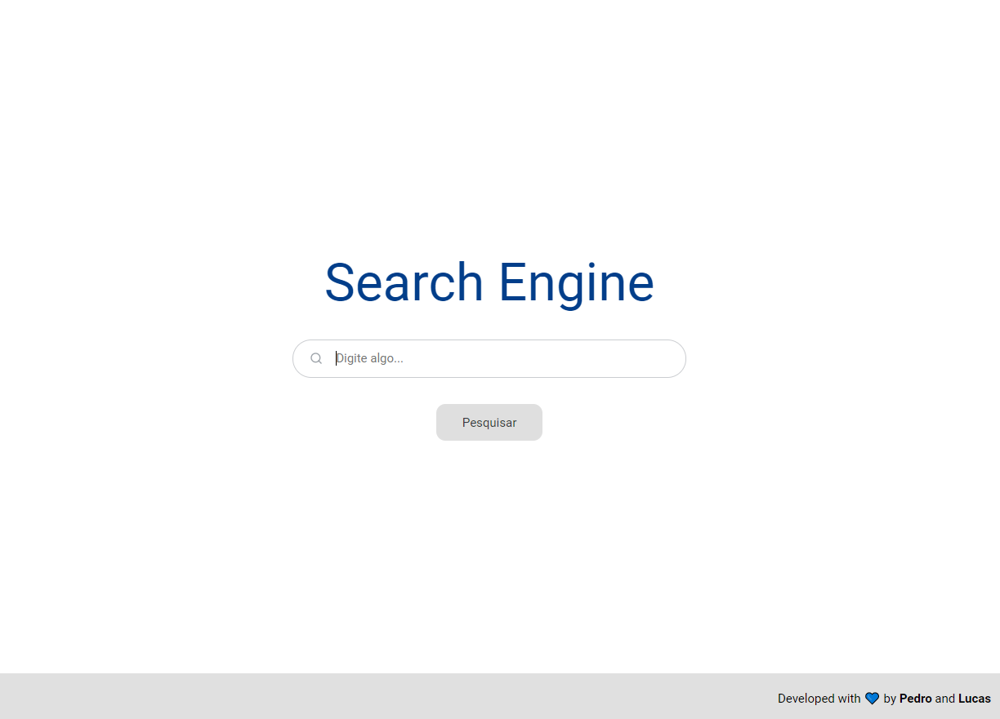
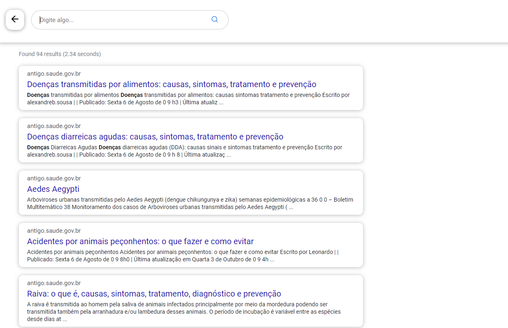

# TCC - Motor de busca com Inteligência Artificial

## :rocket: Tecnologias

O projeto foi desenvolvido com as seguintes tecnologias:

- [React](https://reactjs.org/)
- [Cheerio](https://cheerio.js.org/)
- [Puppeteer](https://pptr.dev/)
- [Request-Promise](https://github.com/request/request-promise)
- [Axios](https://github.com/axios/axios/)

## :computer: Projeto

A ideia do projeto é implementar um motor de busca que a partir de uma base de dados gravada através de um WebCrawler, possa ser feita pesquisas com ajuda de uma rede neural para auxiliar nos resultados dessa pesquisa.

#### WebCrawler
Foi utilizado um site de dominio publico com foco em doenças no geral como base para o Crawler obter as informações das páginas disponíveis. A cada uma hora ele é executado para verificar se novas informações foram inseridas e atualizar o banco de dados.
#### Rede Neural
A Rede Neural utilizada para este projeto foi a ARTMAP Fuzzy, que é executada sempre que uma nova pesquisa é realizada e suas informações é inserida no bando de dados.

## :bookmark: Layout

Abaixo estão o layout das duas telas desenvolvidas.

    
     
     
    

---
Feito com :blue_heart: by [Pedro](https://github.com/pedrocs378/) e [Lucas](https://github.com/feernando998)
  
